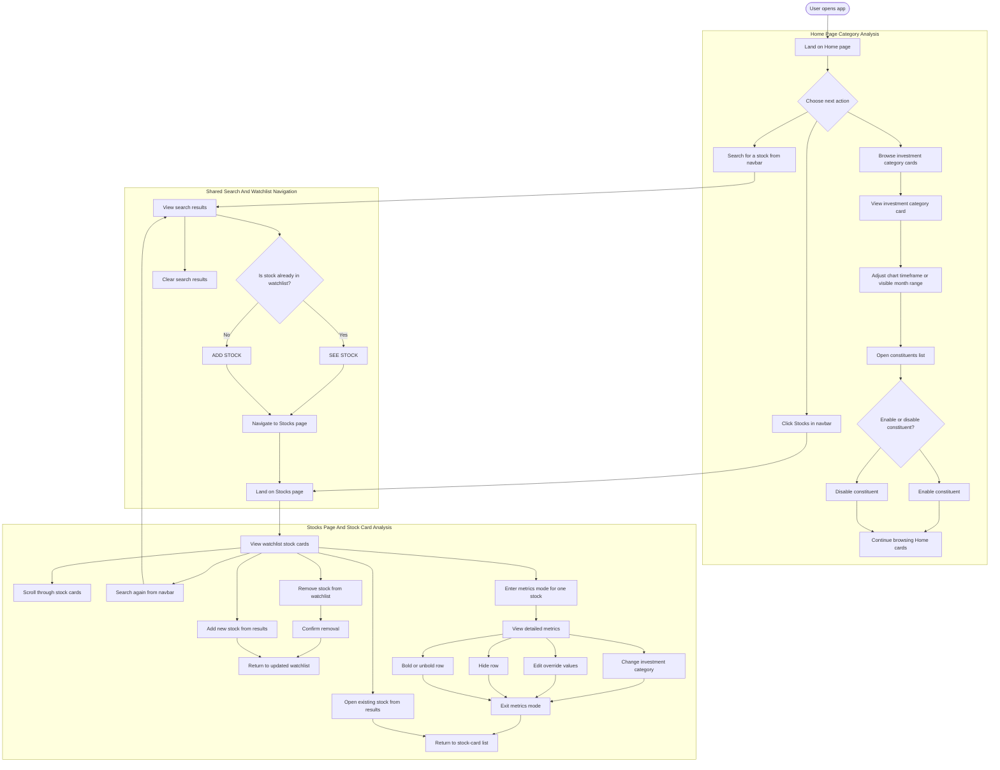

# Beginner-Focused Architecture Diagram

This diagram shows the app as a beginner-friendly early-stage architecture view.
It keeps the main building blocks, boundaries, interfaces, and external systems visible
without dropping down to file-by-file implementation detail.

## High-Level Diagram

```mermaid
flowchart LR
    user[User]

    subgraph presentation[Presentation Layer]
        nav[Navigation + Search UI]
        home[Home Page]
        stocks[Stocks Page]
    end

    subgraph frontend[Frontend Application Layer<br/>React App (Browser)]
        shared[Shared Stock Search State]
        frontApi[Frontend API Services]
    end

    subgraph backendApi[Backend API Layer<br/>Express Server]
        lookupApi[Stock Lookup API]
        watchlistApi[Watchlist API]
        homepageApi[Homepage Category API]
    end

    subgraph backendLogic[Backend Business/Data Access Layer]
        roicService[Stock Search / ROIC Integration Service]
        watchlistService[Watchlist & Dashboard Service]
        homepageService[Homepage Category Cards Service]
        persistence[MongoDB Models / Persistence]
    end

    subgraph external[External Systems]
        mongo[(MongoDB Database)]
        roic[ROIC External API]
    end

    user -->|search, navigate| nav
    user -->|view category cards| home
    user -->|view watchlist dashboards| stocks

    nav -->|update search text, results, watchlist state| shared
    home -->|request category cards| frontApi
    stocks -->|request dashboards, metrics view, refresh, remove| frontApi
    shared -->|search stocks, load watchlist summary, import/open/remove stock| frontApi

    frontApi -->|HTTP + JSON over /api/*| lookupApi
    frontApi -->|HTTP + JSON over /api/*| watchlistApi
    frontApi -->|HTTP + JSON over /api/*| homepageApi

    lookupApi -->|/api/stocks/search<br/>/api/stock-prices/:ticker| roicService
    watchlistApi -->|/api/watchlist/summary<br/>/api/watchlist/dashboards<br/>/api/watchlist/import<br/>/api/watchlist/:ticker| watchlistService
    homepageApi -->|/api/homepage/investment-category-cards/query| homepageService

    roicService -->|external API requests| roic
    watchlistService -->|service calls| persistence
    homepageService -->|service calls| persistence
    persistence -->|Mongo queries| mongo
```

## Legend

- Boxes = components or modules
- Arrows = communication or dependency
- Outer grouped boxes = architectural boundaries or layers

## Beginner Notes

- The frontend does not talk to MongoDB or ROIC directly. It always goes through the Express API.
- The backend is split into three concerns: stock lookup, watchlist management, and homepage category cards.

## How To Read It

- Start on the left with the `User`.
- Move across to the browser-based React app, where the user interacts with navigation, search, `Home`, and `Stocks`.
- The frontend sends HTTP + JSON requests to the Express backend.
- The backend separates request handling into three API concerns, then delegates to business/data services.
- MongoDB stores the app's own persistent data, while ROIC provides the main third-party market and company data.

## User Flow Diagram

This is a current-state user flow diagram. It shows the main steps a user can take
while interacting with the app, without dropping down into backend or data-storage details.



## User Flow Notes

- `Home` and `Stocks` are the two main page destinations in the app.
- Navbar search is shared across both pages.
- Search results use `SEE STOCK` for stocks already in the watchlist and `ADD STOCK` for new ones.
- Home category cards support chart-range changes, constituents viewing, and constituent enable/disable.
- The deeper stock-analysis path lives on the `Stocks` page through stock cards and focused metrics mode.
- This diagram intentionally does not show a direct constituent-row click-through to an individual stock card, because that is not the current verified interaction.

## Key And Supporting Files By Architecture Block

This section maps each diagram block to the main files you would open first.

### Presentation layer

#### a) Navigation + Search UI navbar

Key files:

- [`src/components/NavBar.jsx`](../src/components/NavBar.jsx) - the navbar UI, menu links, and search form.
- [`src/components/StockSearchResults.jsx`](../src/components/StockSearchResults.jsx) - the shared search-results panel shown after searching.

Supporting files:

- [`src/components/stockSearchResultsLayout.js`](../src/components/stockSearchResultsLayout.js) - shared width/layout contract for the search-results panel.
- [`src/App.jsx`](../src/App.jsx) - wires the navbar into the app shell so it appears above the routed pages.

#### b) Home Page

Key files:

- [`src/pages/Home.jsx`](../src/pages/Home.jsx) - main Home page container and layout.
- [`src/components/SectorCardComponent.jsx`](../src/components/SectorCardComponent.jsx) - main UI card for each investment category.
- [`src/components/SectorChart.jsx`](../src/components/SectorChart.jsx) - chart shown inside each category card.

Supporting files:

- [`src/components/StockSearchResults.jsx`](../src/components/StockSearchResults.jsx) - shared search-results UI also rendered on Home.

#### c) Stocks Page

Key files:

- [`src/pages/Stocks.jsx`](../src/pages/Stocks.jsx) - main Stocks page container and page-level orchestration.
- [`src/components/SharePriceDashboard.jsx`](../src/components/SharePriceDashboard.jsx) - main watchlist stock card UI.

Supporting files:

- [`src/components/StockSearchResults.jsx`](../src/components/StockSearchResults.jsx) - shared search-results UI rendered above the stock cards.

### The Frontend Application Layer

#### a) Shared Stock Search State

Key files:

- [`src/contexts/StockSearchContext.jsx`](../src/contexts/StockSearchContext.jsx) - shared search and watchlist state used across pages.

Supporting files:

- [`src/hooks/useStockSearch.js`](../src/hooks/useStockSearch.js) - hook that lets components consume the shared search state.
- [`src/App.jsx`](../src/App.jsx) - wraps the app in `StockSearchProvider`.

#### b) Frontend API Services

Key files:

- [`src/services/investmentCategoryCardsApi.js`](../src/services/investmentCategoryCardsApi.js) - frontend API adapter for Home page category cards.
- [`src/services/watchlistDashboardApi.js`](../src/services/watchlistDashboardApi.js) - public frontend API entry point for watchlist dashboard reads and mutations.

Supporting files:

- [`src/services/watchlistDashboardApi.reads.js`](../src/services/watchlistDashboardApi.reads.js) - dashboard data loading helpers.
- [`src/services/watchlistDashboardApi.mutations.js`](../src/services/watchlistDashboardApi.mutations.js) - dashboard update/mutation helpers.
- [`src/services/watchlistDashboardApi.normalizers.js`](../src/services/watchlistDashboardApi.normalizers.js) - browser-side payload normalization.

### The Bridge: HTTP + JSON over /api/*

Key files:

- [`src/services/investmentCategoryCardsApi.js`](../src/services/investmentCategoryCardsApi.js) - sends frontend requests into `/api/homepage/...`.
- [`src/contexts/StockSearchContext.jsx`](../src/contexts/StockSearchContext.jsx) - sends shared search/watchlist requests into `/api/stocks/...` and `/api/watchlist/...`.
- [`src/services/watchlistDashboardApi.reads.js`](../src/services/watchlistDashboardApi.reads.js) - sends dashboard read requests into `/api/watchlist/...`.
- [`src/services/watchlistDashboardApi.mutations.js`](../src/services/watchlistDashboardApi.mutations.js) - sends dashboard mutation requests into `/api/watchlist/...`.
- [`server.js`](../server.js) - mounts the backend route groups under `/api`.

Supporting files:

- [`routes/stockLookupRoutes.js`](../routes/stockLookupRoutes.js) - read-only stock lookup endpoints.
- [`routes/watchlistRoutes.js`](../routes/watchlistRoutes.js) - watchlist and dashboard endpoints.
- [`routes/investmentCategoryCardsRoutes.js`](../routes/investmentCategoryCardsRoutes.js) - homepage category-card endpoints.

### The Backend API Layer

#### a) Stock Lookup API

Key files:

- [`routes/stockLookupRoutes.js`](../routes/stockLookupRoutes.js) - route definitions for live search and price lookup.
- [`controllers/stockLookupController.js`](../controllers/stockLookupController.js) - request validation and JSON response handling for stock lookup.

Supporting files:

- [`server.js`](../server.js) - mounts the stock lookup API under `/api`.

#### b) Watchlist API

Key files:

- [`routes/watchlistRoutes.js`](../routes/watchlistRoutes.js) - route definitions for summary, dashboards, import, CRUD, metrics, and refresh.
- [`controllers/watchlistController.js`](../controllers/watchlistController.js) - core watchlist CRUD, summary, and dashboard bootstrap handlers.
- [`controllers/importController.js`](../controllers/importController.js) - stock import endpoint.
- [`controllers/stockMetricsViewController.js`](../controllers/stockMetricsViewController.js) - metrics-view and row-preference endpoints.
- [`controllers/refreshController.js`](../controllers/refreshController.js) - stock refresh endpoint.
- [`controllers/overrideController.js`](../controllers/overrideController.js) - override update endpoints.

Supporting files:

- [`server.js`](../server.js) - mounts the watchlist API under `/api/watchlist`.

#### c) Homepage Category API

Key files:

- [`routes/investmentCategoryCardsRoutes.js`](../routes/investmentCategoryCardsRoutes.js) - route definitions for homepage category-card queries and updates.
- [`controllers/investmentCategoryCardsController.js`](../controllers/investmentCategoryCardsController.js) - request validation and JSON responses for homepage category cards.

Supporting files:

- [`server.js`](../server.js) - mounts the homepage category API under `/api/homepage/investment-category-cards`.

### The Backend Business/Data Access Layer

#### a) Stock Search / ROIC Integration Service

Key files:

- [`services/stockSearchService.js`](../services/stockSearchService.js) - search classification, ranking, deduplication, and result shaping.
- [`services/roicService.js`](../services/roicService.js) - low-level ROIC API client used to fetch external market/company data.

Supporting files:

- [`services/stockSearchApi.js`](../services/stockSearchApi.js) - backend helper around read-only stock lookup flows.

#### b) Watchlist & Dashboard Service

Key files:

- [`services/watchlistDashboardService.js`](../services/watchlistDashboardService.js) - summary and dashboard bootstrap logic for the Stocks page.
- [`services/stockMetricsViewService.js`](../services/stockMetricsViewService.js) - metrics-view shaping and row-preference support.
- [`services/watchlistStockRefreshService.js`](../services/watchlistStockRefreshService.js) - refreshes ROIC-backed stock data while preserving user data.

Supporting files:

- [`services/normalizationService.js`](../services/normalizationService.js) - converts imported ROIC data into the app's stock document shape.
- [`services/stockDataVersionService.js`](../services/stockDataVersionService.js) - decides whether stored stock documents need refresh or upgrade.

#### c) Homepage Category Cards Service

Key files:

- [`services/investmentCategoryCardsService.js`](../services/investmentCategoryCardsService.js) - builds homepage category-card payloads and updates constituent state.

Supporting files:

- [`services/lensService.js`](../services/lensService.js) - validates and prepares investment-category/lens configuration used by homepage cards.

#### d) MongoDB Models / Persistence

Key files:

- [`models/WatchlistStock.js`](../models/WatchlistStock.js) - main watchlist stock document.
- [`models/StockMetricsRowPreference.js`](../models/StockMetricsRowPreference.js) - persisted row-level preferences for stock cards.
- [`models/InvestmentCategoryConstituentPreference.js`](../models/InvestmentCategoryConstituentPreference.js) - persisted constituent toggles for homepage cards.
- [`models/StockPriceHistoryCache.js`](../models/StockPriceHistoryCache.js) - cached price history used by homepage category cards.
- [`models/Lens.js`](../models/Lens.js) - lens/category configuration stored in MongoDB.

Supporting files:

- [`config/db.js`](../config/db.js) - MongoDB connection setup used by the Express server.

### External Systems

#### a) ROIC External API

Key files:

- [`services/roicService.js`](../services/roicService.js) - the main backend boundary to the ROIC API.

Supporting files:

- [`services/stockSearchService.js`](../services/stockSearchService.js) - uses ROIC-backed data to build search results.
- [`services/watchlistStockRefreshService.js`](../services/watchlistStockRefreshService.js) - uses ROIC-backed datasets during import/refresh workflows.
- [`services/investmentCategoryCardsService.js`](../services/investmentCategoryCardsService.js) - uses ROIC-backed price data for homepage cards.

#### b) MongoDB Database

Key files:

- [`config/db.js`](../config/db.js) - opens and closes the database connection.
- [`server.js`](../server.js) - starts the app and connects to MongoDB during backend startup.

Supporting files:

- [`models/WatchlistStock.js`](../models/WatchlistStock.js)
- [`models/StockMetricsRowPreference.js`](../models/StockMetricsRowPreference.js)
- [`models/InvestmentCategoryConstituentPreference.js`](../models/InvestmentCategoryConstituentPreference.js)
- [`models/StockPriceHistoryCache.js`](../models/StockPriceHistoryCache.js)
- [`models/Lens.js`](../models/Lens.js)
